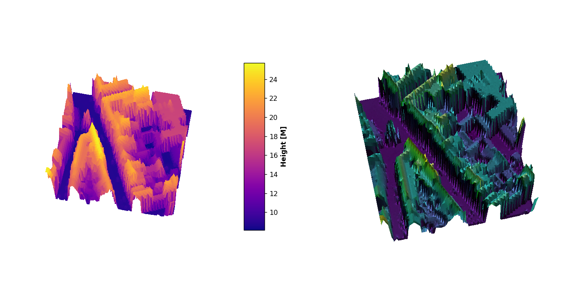

___
# Personal assignment
___
##  :rocket: :rocket:*Welcome to this repository*  :rocket::rocket:
___
### *What ?*
>This program get the coordinates of a location in Brugge and return a 3D plot

### *When ?*
* From 9th till 20th November 2020

### *How ?*
* Use of Mathplotlib, Rasterio, ipywidgets, jupyter lab and numpy
* ipywidgets give some GUI possibilities in Jupyter Lab, see below.

### *Who ?*
* Emmanuel MORANO
